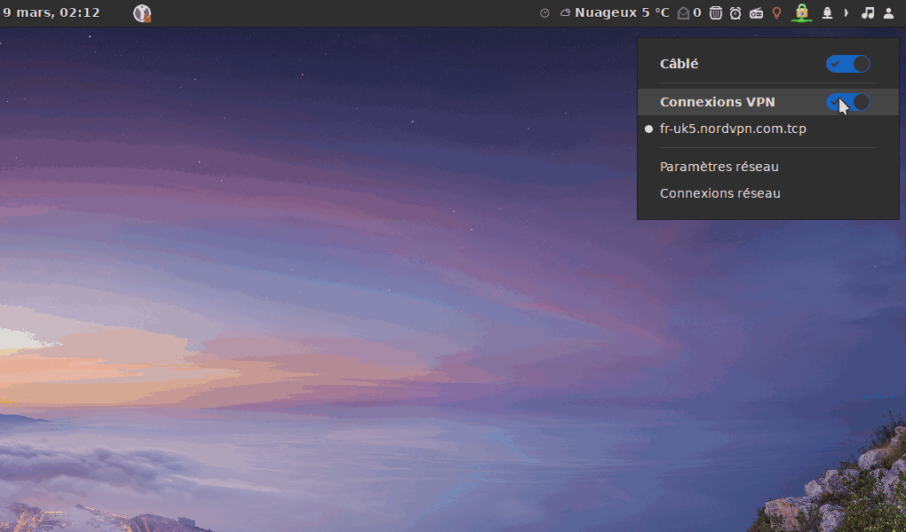

# VPNautoconnect.sh for Linux : Automatically connect to the VPN at startup and reconnect if connection is lost.

[](https://github.com/pzim-devdata/Tools-for-Debian/blob/master/LICENSE)   [](https://github.com/pzim-devdata/Tools-for-Debian/issues)                [](https://GitHub.com/pzim-devata/Tools-for-Debian/commit/)

[Download :inbox_tray:](https://github.com/pzim-devdata/Tools-for-Linux/releases/download/v1.0.0/VPNautoconnect.zip)

## Description :

A script to automatically connect to the VPN at startup (if you lauch this script at startup) and reconnect  every 5 seconds if connection is lost.





## How to install :


1. Download the file "VPNautoconnect.sh" in a folder called `VPN` in your `Home` directory :

```
cd ~
wget https://raw.githubusercontent.com/pzim-devdata/Tools-for-Debian/master/VPNautoconnect/VPNautoconnect.sh -P VPN
```


2. You must first know your UUID for the VPN connection and the name of this connection:

    - Type in the Terminal **when you are connected to the VPN** :

`nmcli con`


3. Copy the VPN name and UUID:


4. Paste the VPN name and UUID in the "VPNautoconnect.sh" file :

To open "VPNautoconnect.sh" tape in your terminal :
```
cd ~
sudo gedit VPN/VPNautoconnect.sh
``` 


5. Then open your Terminal in the folder where "VPNautoconnect.sh" is located and type :

```
cd ~
chmod +x VPN/VPNautoconnect.sh
``` 


6. Connect to the VPN at startup :

If you want to connect to the VPN automatically at startup :

   - Enter the address of the script "VPNautoconnect.sh" (which is `VPN/VPNautoconnect.sh`)  in your favorite startup tool : like "gnome-tweak-tool" for Gnome or other startup applications for other desktop environment : https://winaero.com/blog/manage-startup-apps-linux-mint/

   - Or you can edit "crontab" (doesn't work for me):

        - Tape in your Terminal :
        
            `sudo crontab -e`

        - Then copy this line at the end of the document :

            `@reboot /path/to/my/script/VPNautoconnect.sh`

            or in our example :

            `@reboot VPN/VPNautoconnect.sh` 


        - Tape CTRL + X then y and Enter to save the document


Reboot an enjoy ! :blush:


-----------------------------------------


In bonus, you can [download 3 little scripts for Nemo or Nautilus](https://github.com/pzim-devdata/Tools-for-Linux/raw/master/VPNautoconnect/Scripts.zip) in order to connect or disconnect quickly and easily :blush:
Install them in this directory :

- For Caja (Mate) in : ~/.config/caja/scripts.
- For Nautilus (Gnome/Unity) in : ~/.local/share/nautilus/scripts
- For Némo (Cinnamon) in : ~/.local/share/nemo/scripts/


   
